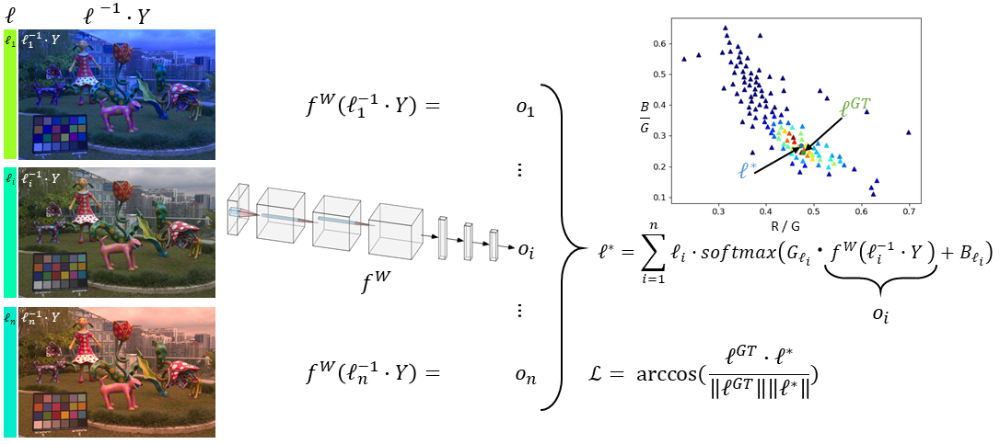
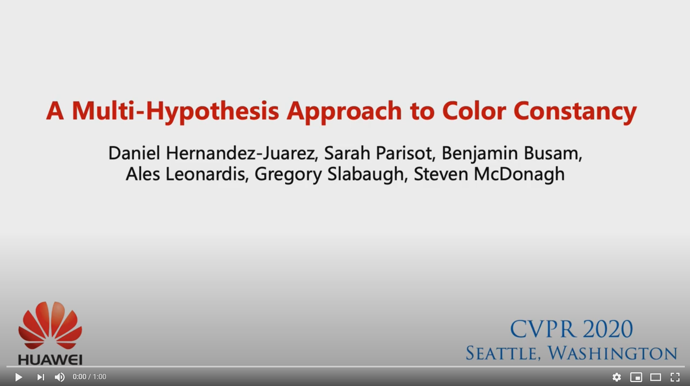

# **A Multi-Hypothesis Approach to Color Constancy**

**Daniel Hernandez-Juarez, Sarah Parisot, Benjamin Busam, Ales Leonardis, Gregory Slabaugh and Steven McDonagh**

**CVPR, 2020**

[paper](https://arxiv.org/abs/2002.12896 "A Multi-Hypothesis Approach to Color Constancy paper") / [poster](https://github.com/smcdonagh/multi_hyp_cc/blob/master/06066-poster.pdf "A Multi-Hypothesis Approach to Color Constancy poster") / [code](https://github.com/huawei-noah/multi_hyp_cc "A Multi-Hypothesis Approach to Color Constancy code") / [supplement](https://arxiv.org/abs/2002.12896) / [video](https://youtu.be/3NjLnmFyXwI) / [blog post](https://blog.huawei.com/tag/noahs-ark-labs/)

*Contemporary approaches frame the color constancy problem as learning camera specific illuminant mappings. While high accuracy can be achieved on camera specific data, these models depend on camera spectral sensitivity and typically exhibit poor generalisation to new devices. Additionally, regression methods produce point estimates that do not explicitly account for potential ambiguities among plausible illuminant solutions, due to the ill-posed nature of the problem. We propose a Bayesian framework that naturally handles color constancy ambiguity via a multi-hypothesis strategy. Firstly, we select a set of candidate scene illuminants in a data-driven fashion and apply them to a target image to generate a set of corrected images. Secondly, we estimate, for each corrected image, the likelihood of the light source being achromatic using a camera-agnostic CNN. Finally, our method explicitly learns a final illumination estimate from the generated posterior probability distribution. Our likelihood estimator learns to answer a camera-agnostic question and thus enables effective multi-camera training by disentangling illuminant estimation from the supervised learning task. We extensively evaluate our proposed approach and additionally set a benchmark for novel sensor generalisation without re-training. Our method provides state-of-the-art accuracy on multiple public datasets up to 11% median angular error improvement while maintaining real-time execution.*

# Required hardware

We tested this on a Nvidia Tesla V100 with 32 GB of memory. You can reduce the batch size in the json of every experiment, but results could be different.

# Set dataset paths

You need to set the dataset path in data/paths.json

# Install required packages

You can use the "Dockerfile" included to make sure all the needed packages are installed. Alternatively, we provide a requirements.txt to install required packages with pip (pip install -r requirements.txt).

# Reproducing paper experiments
(Table index matches arXiv paper version)

In order to run the paper experiments, use "bash ./experiments/experiment1.sh":

| Table                             |   Script         |
| --------------------------------- | ---------------- |
| Table 1: Ours                     | experiment1.sh   |
| Table 1: Ours (pretrained)        | experiment2.sh   |
| Table 2: Ours                     | experiment3.sh   |
| Table 2: Ours (pretrained)        | experiment4.sh   |
| Table 3: OMPD: FFCC               | experiment5.sh   |
| Table 3: MDT: FFCC                | experiment6.sh   |
| Table 3: OMPD: Ours (pretrained)  | experiment7.sh   |
| Table 3: MDT: Ours (pretrained)   | experiment8.sh   |
| Table 4: Ours                     | experiment9.sh   |
| Table 4: Ours (pretrained)        | experiment10.sh  |
| Table 7: all rows                 | experiment11.sh  |
| Table 8: Ours                     | experiment12.sh  |
| Table 8: all rows                 | experiment13.sh  |

If you want to run other experiments, here's the way of using the cross-validation, hold-out and inference scripts:

# Cross-validation training
python3 crossvalidation.py EXPERIMENT.json DATASET.txt --outputfolder /PATH -gpu GPU_ID

Note that if you don't set the -gpu you'll be using CPU.

# Hold-out training
python3 hold_out.py EXPERIMENT.json DATASET_CLASS_NAME SUBDATASET DATASET_SPLIT_FILE.txt --outputfolder /PATH --testfile DATASET_HOLDOUT_SPLIT.txt -gpu GPU_ID

# Inference for a single file list
python3 inference.py EXPERIMENT.json DATASET_CLASS_NAME SUBDATASET DATASET_HOLDOUT_SPLIT.txt ./PATH_CHECKPOINT --outputfolder /PATH -gpu GPU_ID

# Inference for a dataset (all folds)
python3 inference_dataset.py EXPERIMENT.json DATASET.txt ./PATH_CHECKPOINT --outputfolder /PATH -gpu GPU_ID
